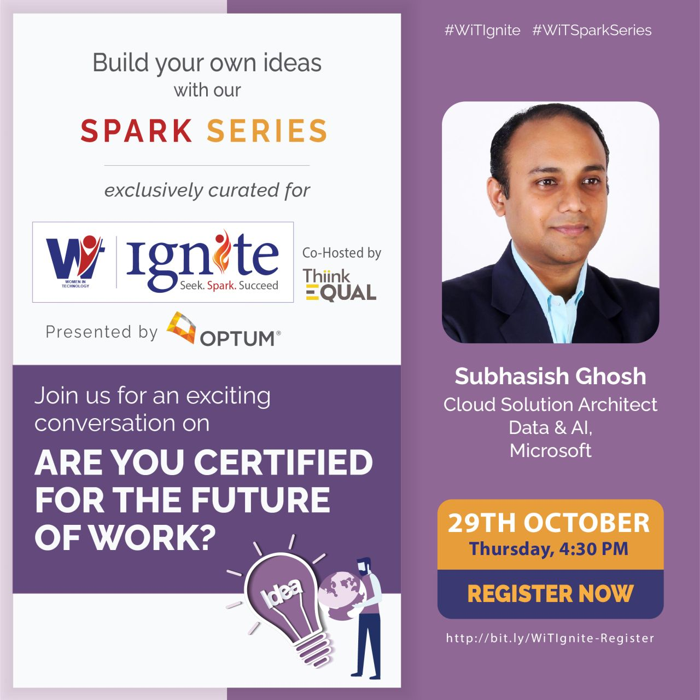
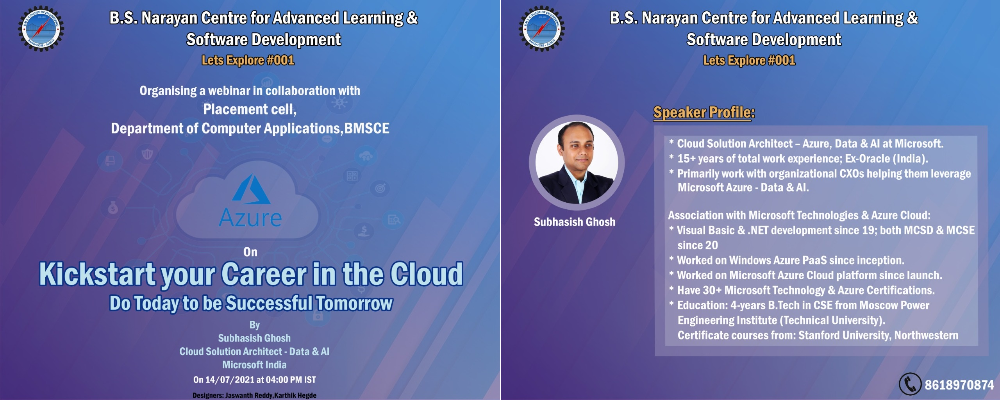
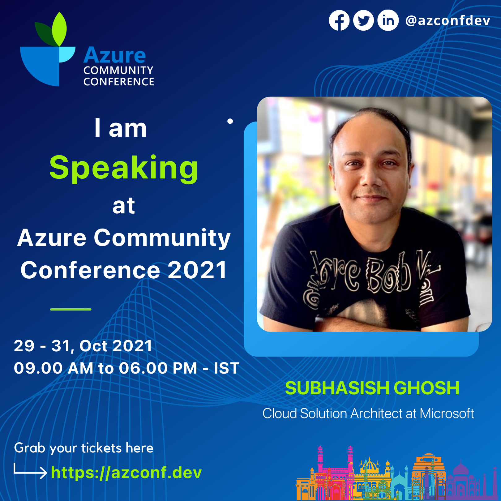
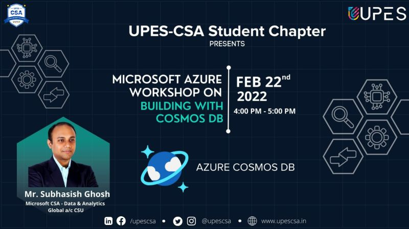
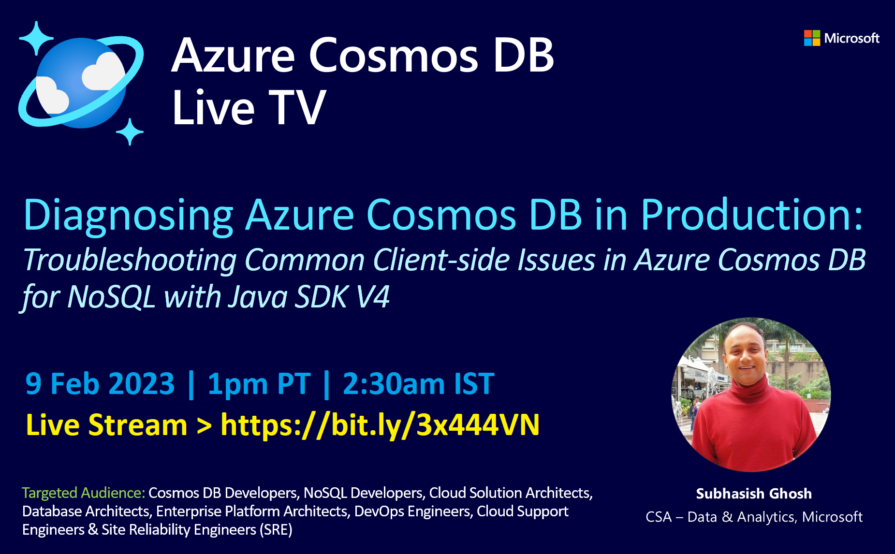
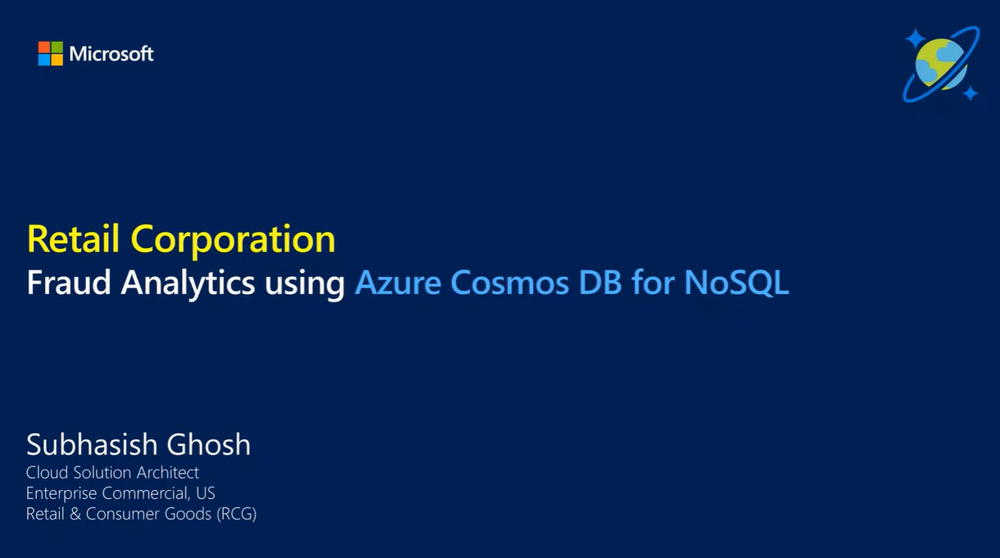
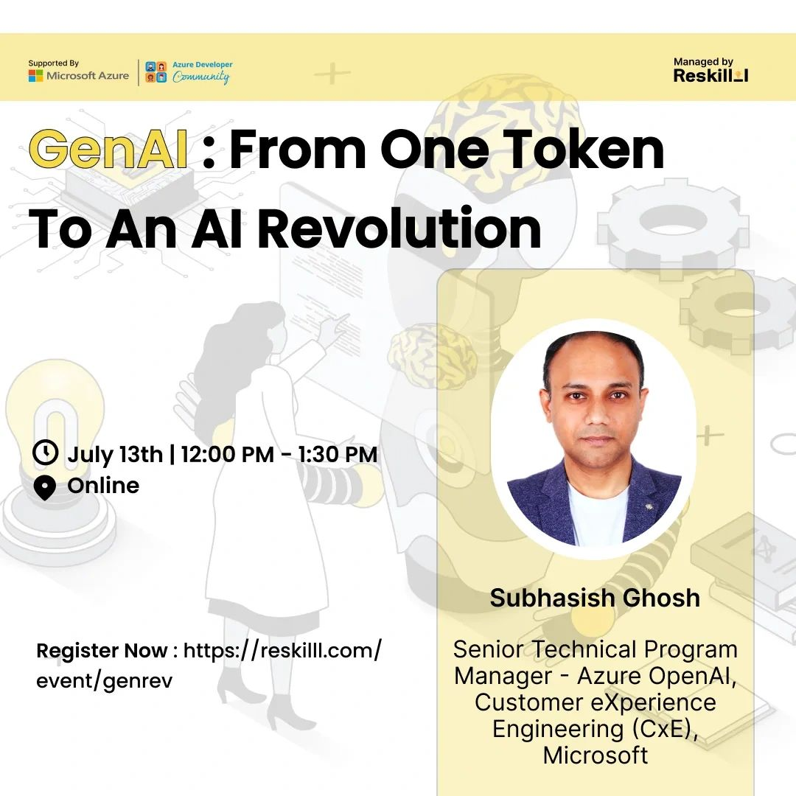
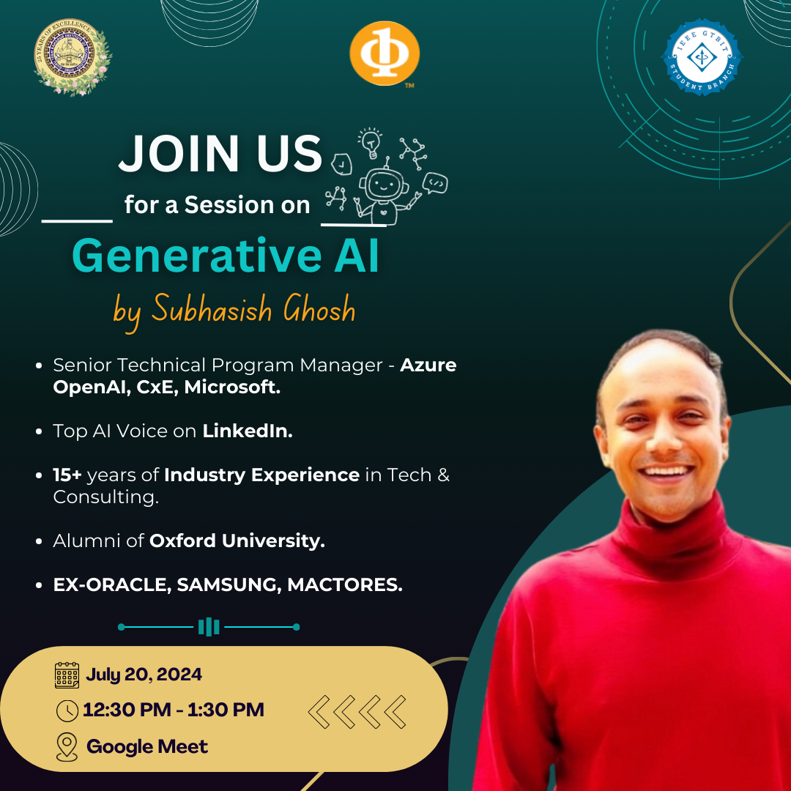

# My Tech Sessions & Blogs
A collection of my Online Tech Sessions, Webinars and Blog posts.
Contact me either on LinkedIn OR at: sugh AT microsoft DOT com for Online/Offsite/Event Speaking Engagements!

## Subhasish Ghosh
Senior Technical Program Manager - Azure OpenAI Service  
Customer eXperience Engineering (CxE)  
Microsoft

## Community Technical Sessions, Online Webinars & Tech Blog Posts:

## 2020:
- **Women in Technology (WiT) Ignite Exclusive Talk with Subhashish Ghosh, Microsoft** | WiT Ignite, a virtual career fair for women in STEM presented by Optum & co-hosted by ThiinkEqual  
Online Session for Working Professionals | 29 October 2020  
Nominated by WorldWide Learning Team, Microsoft as Speaker for the Event  

## 2021:
- **BS Narayan Center, Bhusanayana Mukundadas Sreenivasaiah (BMS) College of Engineering**, in collaboration with Placement Club, Dept. of Computer Applications, BMSCE | Online Session for students | 14 July 2021  
[Watch Recording > Kickstart your Career in the Cloud](https://www.youtube.com/watch?v=rjk6DOpatdQ)

- **Azure Community Conference, AzConf 2021**, in collaboration with Microsoft | Online Session | 29-31 October 2021  
[Watch Recording > AzConf: Leveraging Azure PostgreSQL - Hyperscale (Citus) for 2x performance versus Amazon Redshift](https://www.youtube.com/watch?v=Y13t-VPiZyY)

## 2022:
- **UPES-Cloud Security Alliance Student Chapter**, Online Coding session for students | 22 Feb 2022  
[Watch Recording > Building .NET Application Using Azure Cosmos DB](https://www.youtube.com/watch?v=MWeBGMpJfwY)

- **Azure Cosmos DB Developer Conference** | AzConf 2022 | 19-20 April 2022  
[Watch Recording > Migrating Graph from MariaDB & MongoDB to Azure Cosmos DB’s Gremlin API](https://www.youtube.com/watch?v=ltoRiyHSCwo)

- **Azure Cosmos DB Developer Blog** | 1 Dec 2022 | [Diagnosing & Troubleshooting 4 Common Client-side Issues in Azure Cosmos DB for NoSQL with Java SDK V4](https://devblogs.microsoft.com/cosmosdb/java-sdk-v4-diagnostics/)

## 2023:
- **Azure Cosmos DB Live TV** hosted by [Mark Brown](https://www.linkedin.com/in/markjbrown1/) | 9 Feb 2023  
**Episode 70**: [Watch Recording > Diagnosing Azure Cosmos DB in Production using Azure Cosmos DB Java SDK V4](https://www.youtube.com/watch?v=gaoVMjiFqwE)

- **Azure Cosmos DB Partner Tech Connect 2023 Deep Dive** virtual event | 15 July 2023  
[Watch Recording > Migration performance optimization & Java SDK Learnings at a Large Retail customer](https://www.youtube.com/watch?v=zMl_IboOn3s&t=2471s)

- **Coffee with Azure Cosmos DB** hosted by [Sajeetharan Sinnathurai](https://www.linkedin.com/in/sajeetharan/)
    - **Episode 10**: 31 May 2023: [Watch Recording > Tips and Tricks on Query patterns with Azure Cosmos DB](https://www.youtube.com/watch?v=_ZmV7twEMFA)
    - **Episode 14**: 26 July 2023: [Watch Recording > Partitioning Well Done with Azure Cosmos DB](https://www.youtube.com/watch?v=h__iJ3tideU)

- **Azure Cosmos DB Developer Blog** | Sep 5 2023 | [4 Design Patterns to Deal with Large Item Sizes in Azure Cosmos DB for NoSQL](https://devblogs.microsoft.com/cosmosdb/4-design-patterns-to-deal-with-large-item-sizes/)

## 2024:
- **Azure Cosmos DB Developer Blog** | Jan 8 2024 | [Best Practices for Re-modeling Graph database to Azure Cosmos DB for NoSQL](https://devblogs.microsoft.com/cosmosdb/best-practices-for-re-modeling-graph-database-to-azure-cosmos-db-for-nosql/)

- **Coffee with Azure Cosmos DB** hosted by [Sajeetharan Sinnathurai](https://www.linkedin.com/in/sajeetharan/)
    - **Episode 25**: 17 Jan 2024: [Watch Recording > Azure Cosmos DB - Troubleshooting in production using Java v4 SDK](https://www.youtube.com/watch?v=DmvkeZ4hE10)
 
- **Azure Cosmos DB Developer Blog** | Feb 22 2024 | [MongoDB to Azure Cosmos DB for NoSQL Migration – Learnings from Java SDK V4 Micro-Optimizations](https://devblogs.microsoft.com/cosmosdb/mongodb-to-azure-cosmos-db-for-nosql-migration-learnings-from-java-sdk-v4-micro-optimizations/)

- **Microsoft Azure & Microsoft Azure Developer Community, Dehradun** | 13 July 2024 | Generative AI Webinar | GenAI: From One Token To An AI Revolution  
  - Watch Webinar here > [Generative AI: From One Token To An AI Revolution | Online Webinar | Azure Developer Community (ADC)](https://www.youtube.com/watch?v=MDtaY-Lrrcw)  
  - GitHub repo: https://github.com/SubhMSFT/GenAI-13July2024WebinarRepo

 
- **IEEE GTBIT (Guru Tegh Bahadur Institute of Technology) SB** | 20 July 2024 | Generative AI Webinar | Google Meet  

- **Build With Gen AI webinar series at Dear Azure - Azure INDIA community** | TBD August 2024 | Generative AI Webinar | The Small Models Revolution  
  - Watch Webinar here > https://www.linkedin.com/events/thesmallmodelsrevolutionwithmic7220335539672010752/comments/  

 
Contact me on: sugh AT microsoft DOT com for Online/Offsite/Event Speaking Engagements!
